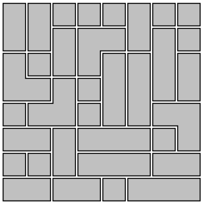

The ZDD-based version is esepecially useful for covering tasks.

For example, it can be used to space-efficiently compute that there
are 92109458286284989468604&nbsp;ways to cover an 8x8 chessboard with
monominoes, dominoes and trominoes.

In addition, solutions can be picked in such a way that each solution
is equally likely.

Sample solution:

